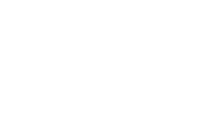

# 
# Prosper Engineering Team Robot Template

## Installation & Setup

Below is a list of instructions to properly *build* the project, see [requirements](##Requirements)

1. Clone the repository with `git clone https://github.com/FRC5411/template-base.git`
2. Build the repository with `./gradlew build` or `./gradlew build` if you do not have a local gradle installation

## Requirements

- [JDK 17+](https://adoptium.net/temurin/releases/?version=16)
    - Windows: install the JDK 16 .msi from the link above
    - macOS: install the JDK 16 .pkg from the link above
    - Linux:
        - Arch-Based: run `sudo pacman -Syu jdk-openjdk`
        - Debian-Based: run `sudo apt install default-jre`
        - RHEL-Based: run `sudo dnf install java-latest-openjdk-devel.x86_64`
- [Gradle 7+ (Optional)](https://gradle.org/releases/)
    - Follow Gradle's installation [guide](https://gradle.org/install/#prerequisites)
- [WPI VSCode (Optional)](https://github.com/wpilibsuite/allwpilib/releases/tag/v2023.4.3)
    - Follow WPILib's [guide](https://docs.wpilib.org/en/stable/docs/zero-to-robot/step-2/wpilib-setup.html)
- [AdvantageScope (Optional)](https://github.com/Mechanical-Advantage/AdvantageScope/releases)
    - Install the latest Release for your OS and Architecture
    - Execute the distribution to start the Install Wizard
      
## Structure & Organization

The project is organized based on WPILib's command-based control structure modified to fit our own needs and can be found [here](https://docs.google.com/document/d/1IrDxQFM6M3gsqsZLIETJGJXaWM8zJ7IgAcHsC6BfKdk/edit?usp=sharing).

## Gradle 

#### All tasks follow a simple format:

run `./gradlew {Modifier} {Task} --{Property} -x {Task}`

All gradle tasks essentially follow this format, where a task can be run (such as `build`), along with any tasks it depends on, or is finalized by.

(Note that `-x {Task}` is used to exclude specific tasks from being run, but should not be needed under normal circumstances).

- Modifier: Mostly applicable to 'build', also apply specific changes to the running of tasks, like 'clean', which ensures that the tasks is **completely** run again, without skipping steps.

- Task: configured in gradle, like `build`, `test`, and `checkAkitInstall`, which use the Gradle API to perform specific 'task' actions on the written code within the project, like compiling, testing, or simply checking the validity of installation.

- Property: also confgiured in gradle, allow you to modify the task with additional 'arguments' such as `--scan`, or `--warning-mode {Level}`, which will also perform a [build scan](https://docs.gradle.org/current/userguide/build_scans.html).

### Build  

run `./gradlew build`

This builds your project, essentially compiling your code, running any [Unit Tests](https://docs.wpilib.org/en/stable/docs/software/wpilib-tools/robot-simulation/unit-testing.html) that have been written, and performs any additional build tasks such as checking your AdvantageKit installation's validity.
### Deploy

run `./gradlew deploy`

This will deploy your robot to a valid roboRIO found on the network. This includes not only robots connected over WI-FI connections, but Ethernet. If the code fails to build, either by failing Unit Tests or syntax errors, your code **will not** be deployed. If the code fails at runtime however, the code will still be deployed, and any runtime exceptions can be seen in the *Driverstation*.

### Simulate

run `./gradlew simulateExternalJavaRelease   -Dorg.gradle.java.home="{JDKLocation}"`

This not only builds your project, but will also simulate the code in a java environment, but it is preferred to use the built-in WPILib support for this functionality that has the JDK location defined already.

### Test

run `./gradlew test`

This will run any [Unit Tests](https://docs.wpilib.org/en/stable/docs/software/wpilib-tools/robot-simulation/unit-testing.html) that have been written in the **appropriate directory**. If any Unit Tests fail, then your build will also fail subsequently, this is to ensure code quality and coverage for edge-cases.

### JavaDoc

run `./gradlew javaDoc`

This will generate viewable HTML javaDocs from the provided documented classes, methods, and types within your code, **only the properly documented types will be generated into javaDocs**, this is not an automatic process and must be done manually. 

